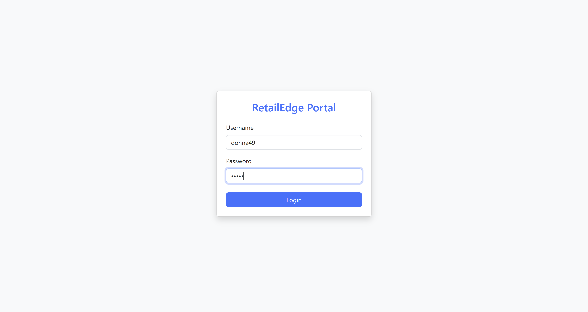
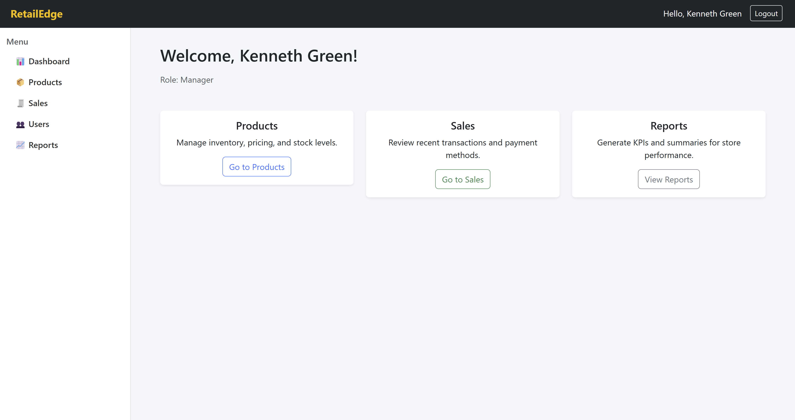
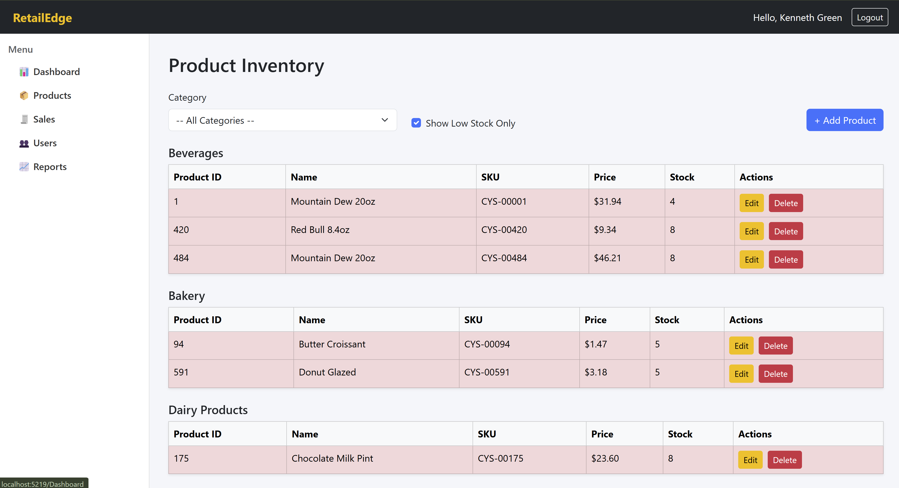
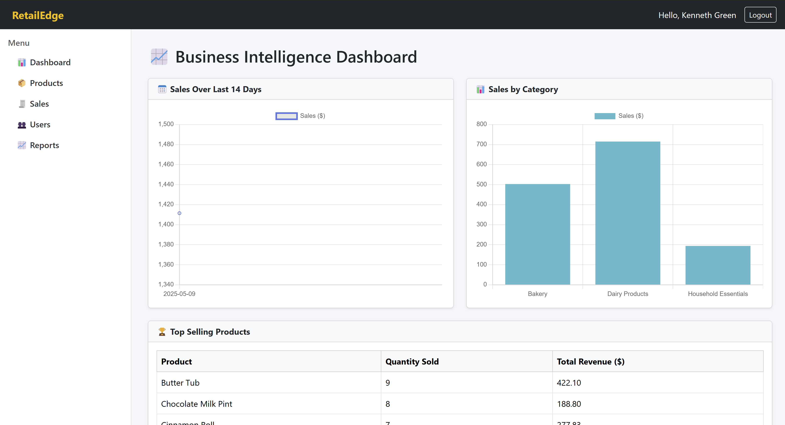
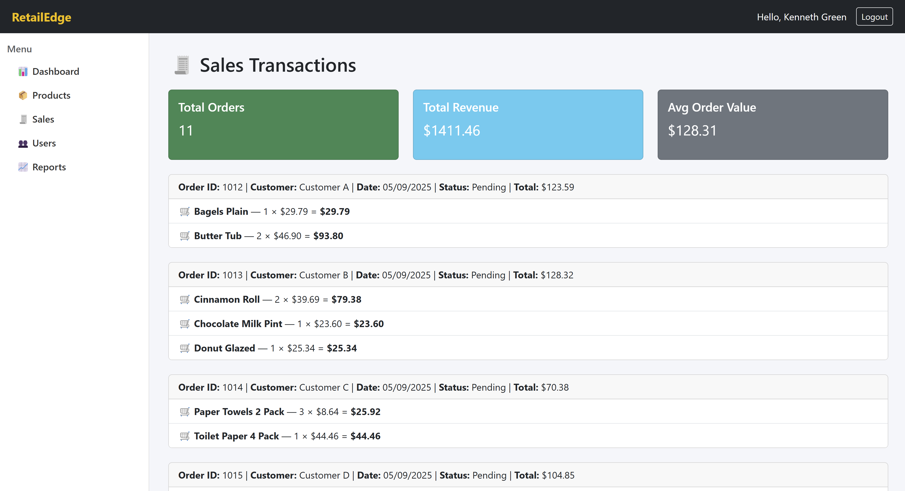

# 🛍️ RetailEdge

RetailEdge is a feature-rich, enterprise-grade retail inventory and sales management system built with **ASP.NET**, **Oracle DB**, **SQL Server**, and **WinForms/VBScript** — inspired by real-world merchandising platforms used in large retail chains like Casey’s and Walmart.

---

## ✨ Key Features

- 🔐 **Secure Admin Login** with role-based access
- 📦 **Product Management** with real-time stock indicators
- 📑 **Vendor & Purchase Order Tracking**
- 🧾 **Sales Dashboard** with filters and revenue stats
- 📊 **BI Reports** using interactive charts
- 🧠 **PL/SQL Procedures & Triggers** for business logic
- ⏱️ **Scheduled Automation** via VBScript & Task Scheduler
- 🖥️ Hybrid app using **ASP.NET Razor Pagess**
- 📤 Export to CSV & PDF (coming soon)

---

## 💻 Tech Stack

| Layer               | Technologies Used                                                             |
|---------------------|--------------------------------------------------------------------------------|
| 👨‍💻 Frontend        | ASP.NET Razor Pages, Bootstrap                                   |
| 🧠 Backend         | C#, PL/SQL, Oracle Stored Procs, VBScript                               |
| 🗄️ Databases        | Oracle DB (Inventory Core)               |                                |
| ⚙️ Automation       | Windows Task Scheduler + VBScript batch jobs                                  |
| 📈 BI & Reporting   | Chart.js, Dynamic SQL views, Custom Reporting scripts                         |

---

## 🖼️ Screenshots

| Page             | Preview                                   |
|------------------|--------------------------------------------|
| 🔐 Login Page     |                 |
| 📊 Dashboard      |          |
| 🛒 Products Page  |            |
| 📈 Reports Page   |               |
| 💵 Sales Page     |                  |

> 💡 All screenshots are stored in `/screenshots` — easy to manage and update!

---

## 🚀 Getting Started

### ⚙️ Prerequisites

- Oracle 21c XE or higher
- .NET SDK 6+
- Oracle.ManagedDataAccess NuGet package

### 📦 Clone & Run

git clone https://github.com/lalicodes/RetailEdge.git
cd RetailEdge
dotnet restore
dotnet run

🔧 Configuration
Update your DB connection in OracleHelper.cs:

"User Id=system;Password=RetailEdge2025;Data Source=//192.168.79.104:1521/XE;"

🧪 Sample Query (Oracle)

SELECT product_name, quantity_in_stock
FROM products
WHERE quantity_in_stock < 10;

🛠 Planned Enhancements
🔔 Low-stock email alerts

📤 Export sales reports to PDF

🛍️ POS-style front desk interface

🔎 Elastic search for product lookup

📚 Learning Goals
This project demonstrates:

Enterprise DB architecture across Oracle DB

Multi-tier backend design using C#, Razor Pages, and PL/SQL

Real-time retail logic with automation via WinForms/VBScript

Report building and inventory analytics

👨‍💼 Built By
Lali Krishnan
Bachelor of Science, Computer Science
I built this project to simulate the systems used by retail analysts, merchandisers, and IT engineers in national retail chains.

❤️ Like This Project?
Give it a ⭐ on GitHub!
